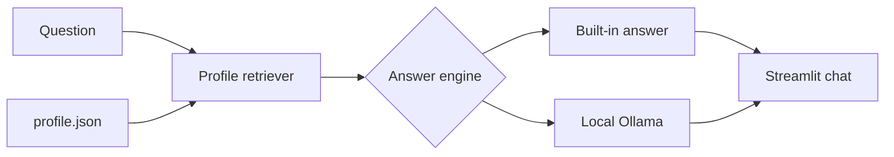

# Simple AI-Powered Personal Digital Twin

A small, beginner-friendly personal digital twin. Ask questions in
a Streamlit chat interface and receive answers grounded in an editable JSON
profile.

This version keeps the main learning idea—**retrieve personal information, then
use it to answer a question**—without databases, external integrations, or paid
API keys.

## What it can do

- Chat through a simple Streamlit web page.
- Read identity, skills, experience, education, projects, and interests from JSON.
- Retrieve the most relevant profile sections for each question.
- Show exactly which profile context supported an answer.
- Work immediately with its built-in retrieval answer generator.
- Optionally use a local Ollama model for more natural first-person answers.
- Run locally or in Docker.

## Simple architecture



This is a small RAG-style flow:

1. **Retrieve:** Find profile sections related to the question.
2. **Augment:** Add those sections as context.
3. **Generate:** Return a built-in answer or ask Ollama to write a natural one.

## Project structure

```text
.
├── app.py                       # Streamlit user interface
├── digital_twin.py              # Retrieval and Ollama logic
├── data/profile.json            # Editable personal information
├── tests/test_digital_twin.py   # Unit tests
├── Dockerfile                   # Container setup
└── requirements.txt             # Python packages
```

## Quick start

### 1. Clone and enter the project

```bash
git clone https://github.com/naimerteza88/AI-powered-personal-digital-twin.git
cd AI-powered-personal-digital-twin
```

### 2. Create a virtual environment

Windows PowerShell:

```powershell
python -m venv .venv
.venv\Scripts\Activate.ps1
```

macOS or Linux:

```bash
python3 -m venv .venv
source .venv/bin/activate
```

### 3. Install and run

```bash
pip install -r requirements.txt
streamlit run app.py
```

Open <http://localhost:8501>. Choose **Built-in retrieval** in the sidebar; no
model or API key is needed.

## Personalize the twin

Open `data/profile.json` and replace the example values with your own facts.
Keep the JSON punctuation valid. You can add new sections too; the retriever
reads all top-level fields automatically.

Do not commit private phone numbers, home addresses, passwords, tokens, or any
other secret information—especially if your GitHub repository is public.

## Optional: use local AI with Ollama

Ollama produces more natural answers but is not required.

1. Install [Ollama](https://ollama.com/).
2. Download a small model:

   ```bash
   ollama pull llama3.2:3b
   ```

3. Make sure Ollama is running.
4. Start the app and choose **Ollama (local AI)** in the sidebar.

If Ollama is unavailable, the app safely falls back to its built-in answer.

## Run with Docker

```bash
docker build -t personal-digital-twin .
docker run --rm -p 8501:8501 personal-digital-twin
```

For Ollama running on the host computer:

```bash
docker run --rm -p 8501:8501 \
  -e OLLAMA_BASE_URL=http://host.docker.internal:11434 \
  personal-digital-twin
```

## Run tests

```bash
python -m unittest discover -s tests -v
```

## How this differs from the reference project

| Area | This project | Reference project |
|---|---|---|
| Interface | One Streamlit page | Next.js API and CLI |
| Personal data | One JSON file | Resume, GitHub, Strava, and more |
| Retrieval | Lightweight token scoring | Embeddings and vector store |
| Model | Optional local Ollama | Full provider and prompt system |
| Setup | Two Python packages | Larger TypeScript application |

## License

MIT
